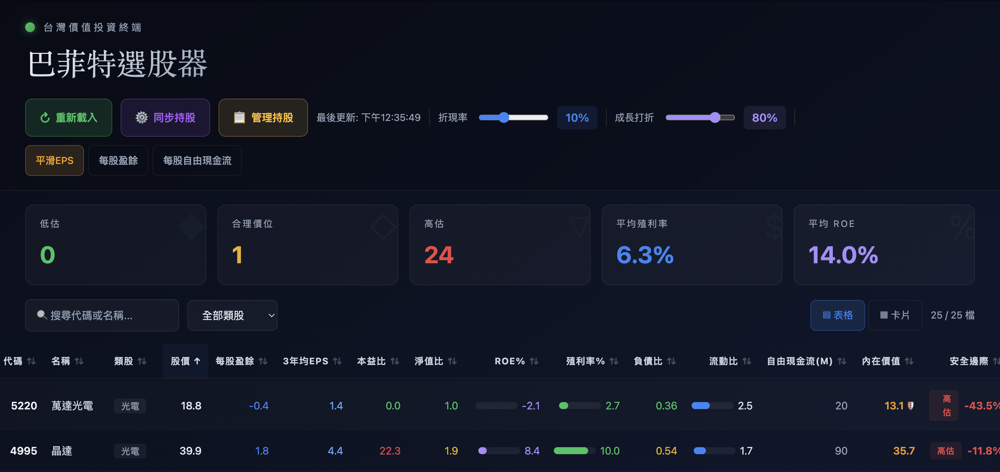

# 🎯 巴菲特選股器 — 台股價值投資儀表板

基於巴菲特價值投資理念的台股篩選儀表板。  
後端 Python + yfinance 抓取即時資料存入 SQLite，前端 React + TypeScript 視覺化呈現。

## ✨ 功能特色

- 📊 **持股即時資料** — Python yfinance 抓取，SQLite 存儲
- 💰 **兩階段 DCF 估值** — 含風險溢酬、資產保底、終值雙重校驗
- 🔍 **多維度篩選** — 類股、搜尋、排序
- 📈 **雙視圖模式** — 表格 / 卡片切換
- 📉 **歷史走勢圖** — 價格、ROE、EPS 疊加顯示
- ➕ **一鍵管理** — 從儀表板直接新增 / 移除持股
- ⏰ **自動排程** — macOS launchd 每日自動同步



## 🏗️ 專案架構

```
├── src/                     # 前端 TypeScript + React
│   ├── main.tsx             # 應用入口
│   ├── dashboard.tsx        # 主儀表板
│   ├── dcf-engine.ts        # DCF 估值引擎
│   ├── types.ts             # 共用型別定義
│   ├── constants.ts         # 常數（閾值、顏色）
│   ├── useDCF.ts            # DCF hook
│   ├── usePortfolioData.ts  # 資料載入 / 同步 hook
│   ├── services/api.ts      # API 封裝
│   ├── DetailPanel.tsx      # 個股深度分析面板
│   ├── ManageModal.tsx      # 管理持股彈窗
│   ├── StockRow.tsx         # 表格列元件
│   ├── StockCard.tsx        # 卡片元件
│   ├── MiniBar.tsx          # 迷你進度條
│   └── HistoryChart.tsx     # 歷史走勢圖
├── fetchers/                # Python 資料抓取（ticker / price / fundamentals）
├── exporters/               # JSON 匯出（stock_data / history）
├── transforms/              # 財報快照建立與歷史修正
├── db/                      # SQLite CRUD
├── schemas/                 # JSON Schema（供 make validate 驗證）
├── tests/                   # DCF 引擎單元測試 + golden snapshots
├── index.html               # Vite 入口 HTML
├── sync_portfolio.py        # 同步主控腳本（一鍵抓取 + 生成 JSON）
├── stock_config.py          # 共用設定（股票清單、DB 路徑、工具函數）
├── query_stock.py           # CLI 股票查詢 / 匯出工具
├── validate_schemas.py      # JSON schema 驗證腳本
├── vite.config.js           # Vite + Dev API Middleware
├── Makefile                 # 常用指令集
└── setup_automation.sh      # macOS launchd 自動排程設定
```

## 🚀 快速開始

### 前置需求

| 工具 | 最低版本 | 檢查方式 |
|------|---------|---------|
| macOS | 12+ (Monterey) | `sw_vers` |
| Node.js | 18+ | `node --version` |
| Python | 3.10+ | `python3 --version` |
| pip 套件 | — | `pip install -r requirements.txt` |

### 1. 安裝依賴

```bash
npm install
pip install -r requirements.txt
```

### 2. 設定持股清單

```bash
cp stock_config.example.json stock_config.local.json
# 編輯 stock_config.local.json，填入你的持股代碼
```

### 3. 首次同步資料

```bash
make sync          # 同步持股資料（Python → SQLite → JSON）
```

### 4. 啟動開發伺服器

```bash
make dev           # 啟動 Vite dev server (http://localhost:3000)
```

## 📖 Makefile 常用指令

| 指令 | 說明 |
|------|------|
| `make help` | 顯示所有指令說明 |
| `make install` | 安裝前端依賴 + 檢查 Python 套件 |
| `make dev` | 啟動 Vite 開發伺服器 (port 3000) |
| `make sync` | 同步全部持股（抓取 + 匯出 JSON + 驗證 schema） |
| `make regen` | 只重新產生 stock_data.json（不重抓） |
| `make export` | 匯出 stock_data.json + history_all.json |
| `make test` | 執行 DCF 引擎測試（單元 + 邊界值） |
| `make validate` | 驗證 JSON 符合 schema |
| `make build` | 建置生產版本（輸出於 dist/） |
| `make status` | 顯示 DB / JSON / 持股清單狀態 |
| `make app` | 建立 macOS 桌面捷徑 (.app) |
| `make clean` | 清除快取、日誌、`__pycache__` |
| `make all` | 完整流程：sync → dev |

## 📱 桌面捷徑（macOS）— 推薦入口

```bash
make app           # 在桌面建立「持股儀表板.app」
```

建立後雙擊桌面上的 **持股儀表板** 即可一鍵啟動儀表板（自動啟動 Vite + 開瀏覽器）。  
關閉瀏覽器分頁後，伺服器會在 10 秒內自動停止。

> 💡 首次開啟如被 Gatekeeper 阻擋，請右鍵 → 打開 → 打開。  
> 💡 首次啟動會自動建立 `stock_config.local.json` 並提示你編輯持股清單。

### 其他啟動方式（開發者用）

| 方式 | 說明 |
|------|------|
| `make dev` | 手動啟動 Vite 開發伺服器（需自行開瀏覽器） |
| `launch_dashboard.command` | 雙擊即開（終端版，可看即時 log） |

## 🎨 評估標準

### 安全邊際分類

- 🟢 **低估** — 安全邊際 ≥ 30%
- 🟡 **合理價位** — 10% ≤ 安全邊際 < 30%
- 🔴 **高估** — 安全邊際 < 10%

### 巴菲特檢核表（7 項）

1. ✓ 低本益比 (< 15)
2. ✓ 低淨值比 (< 1.5)
3. ✓ 高 ROE (> 15%)
4. ✓ 高殖利率 (> 4%)
5. ✓ 低負債比 (< 0.5)
6. ✓ 良好流動性 (流動比 > 2)
7. ✓ 安全邊際 > 30%

## ⚙️ 技術棧

- **React 18** + **TypeScript** — 前端框架
- **Vite 7** — 建置工具 + Dev API Proxy
- **Recharts** — 歷史走勢圖
- **Python 3** + **yfinance** — 後端資料抓取
- **SQLite** — 本地資料庫
- **純 CSS** — 行內樣式（無外部 UI 框架）

## ⚠️ 注意事項

1. **資料來源**：yfinance 免費 API 有速率限制，同步時會自動延遲
2. **投資風險**：本工具僅供參考，請勿作為唯一投資依據
3. **設定檔**：`stock_config.local.json` 已被 `.gitignore` 排除
4. **瀏覽器**：建議使用 Chrome、Firefox、Safari 最新版本

## 📄 授權

MIT License

---

**⚡ 基於巴菲特投資原則 | 價值投資從了解開始**
